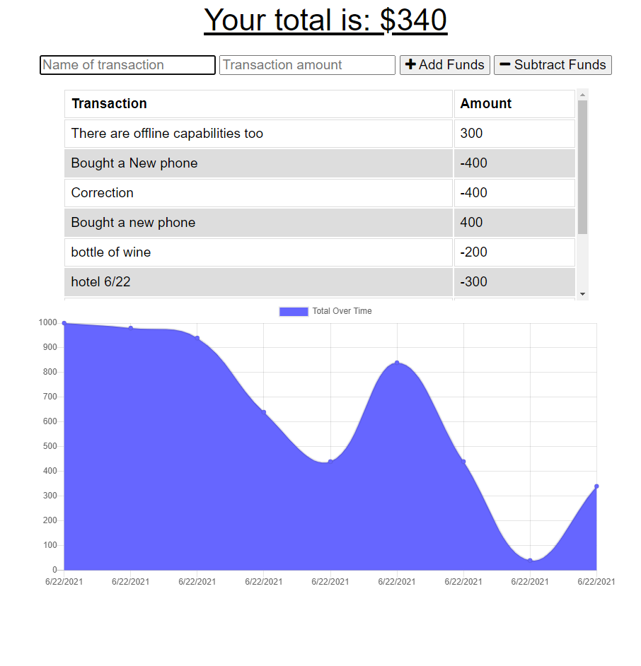

# Budget Tracker

## Description

Having trouble remembering how much money you have left in your budget? Find yourself having trouble checking as internet connections sometimes get spotty? Have no fear as Budget Tracker is here. Budget Tracker is a simple, barebones program that lets you keep track of your finances with a simple add and subtract tracking system. Additionally, Budget Tracker has been fitted with offline functionality that will automatically upload any changes to the server whenever you do find an internet connection.

## Table of Contents
* [Usage](#usage)
* [License](#license)
* [Questions](#questions)

## Usage
Simply Navigate to the following Website. You may also download the PWA application if that strikes your fancy

## License
This project is covered under the MIT license.
[Click here to see the terms of the license](https://choosealicense.com/licenses/mit/)
## Questions
Any questions or concerns?
Contact me on my github: [blazelim](https://github.com/blazelim/)

Or email me at: blazebentleycolim@gmail.com